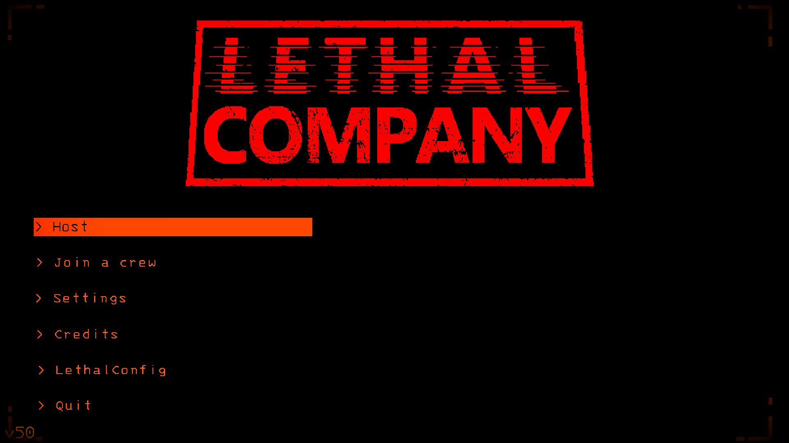

# Custom alias plugin for lethal company

## Goal

To create a fully customisable alias system.

## How does it work?

Aliases are registered with a unique string, as shown in the default configuration below.  
```alias keyword : command``` This is the structure of an alias binding, and each alias binding is separated by a semicolon ```;```.

## How to add/remove/edit?

Characters ```:``` and ```;``` are prohibited in alias/command. You can edit the configuration file by following this rule.  
To add an alias, insert ```your alias: your command``` into the configuration file.  
To delete an alias, remove the line containing the target alias and its associated command.  
Don't forget to separate your alias by a semicolon ```;```.

# To add you can use LethalConfig

To add your alias, you can just put your key/value and push the button add.  
If it doesn't work, try to apply before pushing the button.  



# To Remove you can use LethalConfig

It's the same system than add.

# To search

To search your alias, you can just put your key and push the button search.  
If it doesn't work, try to apply before pushing the button.  


## Default configuration (List alias)

```vm : VIEW MONITOR ; sw : SWITCH ; s : SWITCH ; p : PING ; t : TRANSMIT ; sc : SCAN ; st : STORE ; m : MOONS ; tcb : THE COMPANY BUILDING ; exp : EXPERIMENTATION ; ass : ASSURANCE ; v : VOW ; ma : MARCH ; off : OFFENSE ; ad : ADAMANCE ; re : REND ; di : DINE ; ti : TITAN```
